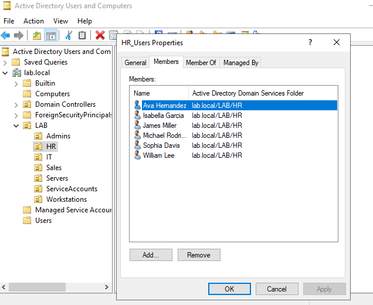
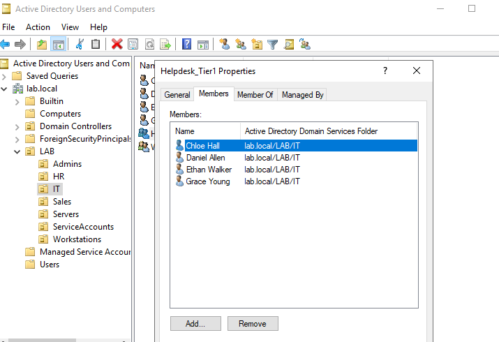
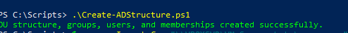

# 🚀 STEP 03 – ACTIVE DIRECTORY AUTOMATION (OUs, USERS, GROUPS)

OVERVIEW 📘 
In this step, I automated the creation of a complete Active Directory structure using PowerShell. This included creating Organizational Units (OUs), security groups, user accounts, and assigning users to groups based on their department. All objects were generated from a CSV file, simulating a realistic enterprise onboarding workflow. Verification was completed using Active Directory Users and Computers (ADUC).

## 📁 PROJECT FOLDER STRUCTURE

lab-step-03-ad-structure-and-users/  
├── README.md ← 📘 Main documentation  
├── scripts/ ← ⚙️ Automation scripts + CSV  
  `├── Create-ADStructure.ps1  
  ├── Create-ADUsers.ps1 (if separate)  
  └── users.csv ` 
└── screenshots/ ← 📸 Verification screenshots 
  `├── 01_lab_ou_structure.png 
  ├── 02_sales_ou_users.png 
  ├── 03_hr_ou_users.png 
  ├── 04_it_ou_users.png 
  ├── 05_admins_ou_users.png 
  ├── 06_sales_users_group.png 
  ├── 07_hr_users_group.png 
  ├── 08_helpdesk_tier1_group.png 
  ├── 09_workstation_admins_group.png 
  ├── 10_it_admins_group.png 
  └── 11_script_execution.png`

## 🗂️ ORGANIZATIONAL UNIT STRUCTURE

The following OUs were created under the root LAB OU:

Admins  
IT  
HR  
Sales  
Workstations  
Servers  
ServiceAccounts  

📸 LAB OU Structure  
🌳 Full OU hierarchy created under the LAB root OU.  

## 👥 USERS IN EACH OU

Users were created from a CSV file containing FirstName, LastName, Department, and Username. Each user was automatically placed into the correct OU.

📸 Sales OU  
🧾 Sales users created and placed in the Sales OU.  

📸 HR OU  
🧾 HR users created and placed in the HR OU.  

📸 IT OU  
🧾 IT users created and placed in the IT OU.  

📸 Admins OU  
🧾 Admin users created and placed in the Admins OU.  

## 🔐 SECURITY GROUPS

The following security groups were created and placed inside their respective OUs:

Admins OU: IT_Admins  
IT OU: Helpdesk_Tier1, Workstation_Admins  
HR OU: HR_Users  
Sales OU: Sales_Users  

## ✅ GROUP MEMBERSHIP VERIFICATION

📸 Sales_Users Group  
👥 Members tab showing all Sales users assigned to the Sales_Users group.  

📸 HR_Users Group  
👥 Members tab showing all HR users assigned to the HR_Users group.  

📸 Helpdesk_Tier1 Group  
👥 Members tab showing IT users assigned to the Helpdesk_Tier1 group.  

📸 Workstation_Admins Group  
👥 Members tab showing Admins and IT users assigned to the Workstation_Admins group.  

📸 IT_Admins Group  
👥 Members tab showing Admins and IT users assigned to the IT_Admins group.  

---

## ⚙️ AUTOMATION SCRIPTS

The scripts used in this step are located in the scripts folder:

- Create-ADStructure.ps1
- users.csv

These scripts automate:  
– OU creation  
– Group creation  
– User creation  
– Group membership assignment  
– CSV-driven provisioning  
– Idempotent logic (safe to re-run without duplicates)

## ▶️ How to Run These Scripts

These automation scripts streamline the setup of your Active Directory environment by creating the OU structure and bulk‑importing users from a CSV file. All commands below are run inside your Windows Server VM.

## 🧩 Prerequisites

Before running the scripts, ensure the following:

- Active Directory Domain Services (AD DS) is installed and the server is promoted to a domain controller
- PowerShell is running as Administrator
- RSAT: Active Directory module is available
- The following files exist in `C:\Scripts`:
  - `Create-ADStructure.ps1`
  - `users.csv`
  - (Optional) `Create-ADUsers.ps1` if user creation is a separate script
- The CSV file includes these headers:
  - `FirstName`, `LastName`, `Username`, `Department`

## ▶️ Running the AD Structure Script

This script builds the full OU hierarchy for your domain.

From an elevated PowerShell window:

*powershell *
`cd C:\Scripts` 
`.\Create-ADStructure.ps1`

### ▶️ Running the Bulk User Creation Script
This script reads `users.csv` and creates users in the correct OUs based on the Department field.

If user creation is included in the same script:

*powershell *
`cd C:\Scripts` 
`.\Create-ADStructure.ps1`

If user creation is a separation script:

*powershell *
`cd C:\Scripts` 
`.\Create-ADUsers.ps1 -CsvPath "C:\Scripts\users.csv"`

You will see output for each user created, including their assigned OU.

### 🔍 Verifying the Results

Open **Active Directory Users and Computers** and confirm:

- All OUs appear under the domain
- All users are created
- Users are placed in the correct OU based on Department
- User attributes match the CSV

### 🛠️ Troubleshooting

**CSV not found** 
`C:\Scripts\users.csv` and the path matches your script's parameter.

**Import-Csv errors** 
Verify the CSV headers exactly match: 
**FirstName,LastName,Username,Department**

**Access denied or insufficient permissions** 
Run Poweshell as Administrator

**OUs not appearing** 
Confirm the AD DS role is installed and the server is a domain controller.

**Users created in the wrong OU** 
Check for typos or inconsistent Department names in the CSV

## 🖥️ SCRIPT EXECUTION

📸 Script Execution  
💻 PowerShell output showing the automation script running successfully.  

## 💬 REFLECTION

This step reinforced several important concepts in enterprise Active Directory management:

• Data-driven automation is essential for scalable user provisioning.  
• A clean and consistent OU structure makes administration and GPO targeting easier.  
• Role-based access control (RBAC) is effectively implemented using security groups.  
• Idempotent scripting ensures the environment can be rebuilt or updated safely.  
• Verification using ADUC is critical to confirm automation results.  

This workflow mirrors real-world IT onboarding processes and demonstrates the ability to automate and validate an entire AD structure from scratch.

